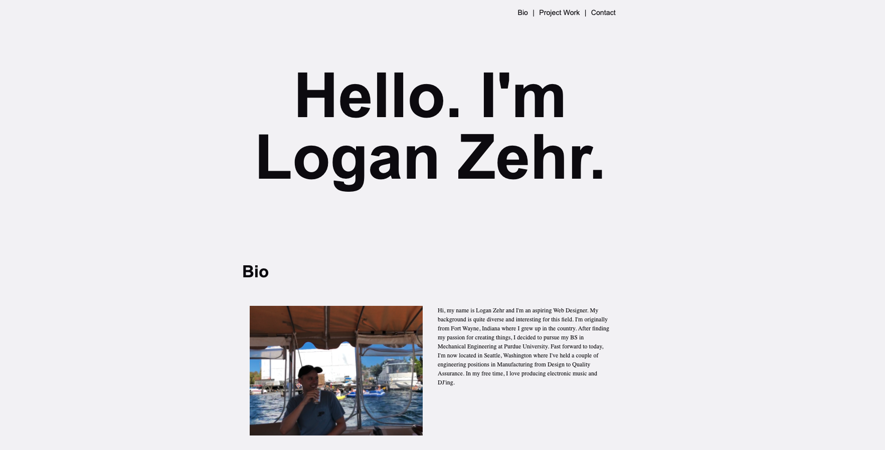

# Logan Zehr - Developer Portfolio

[Link to Assignment Repository](https://github.com/zehrl/developer-portfolio) 
[Link to Assignment Website](https://zehrl.github.io/developer-portfolio/)

---

## Description

### What was the assignment?

In this assignment, I was tasked to develop a responsive portfolio for a web developer (in this case, myself).

### Why?

To help develop my understanding of media queries and general knowledge of what I've learned on HTML & CSS.

## How?

**Media Queries (Magic)**

By utilizing different Media Queries at specified "max-width"s, I was able to scale down different features such as my main introduction text & hide elements such as the "Contact Me" text in the footer.

### What did I learn?

In this assignment, I was able to learn about various topics such as:
* Learning to write informative & adequate README files
* Inserting images into a website
* Flexbox use
* Media Queries

---

## Credits

### Image Placeholders

* [Unsplash image by Dylan Ferreira](https://unsplash.com/@dylanferreira?utm_source=unsplash&amp;utm_medium=referral&amp;utm_content=creditCopyText)

* [Unsplash image by Eduardo Cano Photo Co.](https://unsplash.com/@eduardocanophotoco?utm_source=unsplash&amp;utm_medium=referral&amp;utm_content=creditCopyText)

* [Unsplash image by Marisa Cornelsen](https://unsplash.com/@macornelsen?utm_source=unsplash&amp;utm_medium=referral&amp;utm_content=creditCopyText)

* [Unsplash image by Charles Etoroma](https://unsplash.com/@charlesetoroma?utm_source=unsplash&amp;utm_medium=referral&amp;utm_content=creditCopyText)

### Social Media Icons

* [Font Awesome](https://fontawesome.com)

---

## License
**MIT License**

Copyright (c) [year] [fullname]

Permission is hereby granted, free of charge, to any person obtaining a copy
of this software and associated documentation files (the "Software"), to deal
in the Software without restriction, including without limitation the rights
to use, copy, modify, merge, publish, distribute, sublicense, and/or sell
copies of the Software, and to permit persons to whom the Software is
furnished to do so, subject to the following conditions:

The above copyright notice and this permission notice shall be included in all
copies or substantial portions of the Software.

THE SOFTWARE IS PROVIDED "AS IS", WITHOUT WARRANTY OF ANY KIND, EXPRESS OR
IMPLIED, INCLUDING BUT NOT LIMITED TO THE WARRANTIES OF MERCHANTABILITY,
FITNESS FOR A PARTICULAR PURPOSE AND NONINFRINGEMENT. IN NO EVENT SHALL THE
AUTHORS OR COPYRIGHT HOLDERS BE LIABLE FOR ANY CLAIM, DAMAGES OR OTHER
LIABILITY, WHETHER IN AN ACTION OF CONTRACT, TORT OR OTHERWISE, ARISING FROM,
OUT OF OR IN CONNECTION WITH THE SOFTWARE OR THE USE OR OTHER DEALINGS IN THE
SOFTWARE.